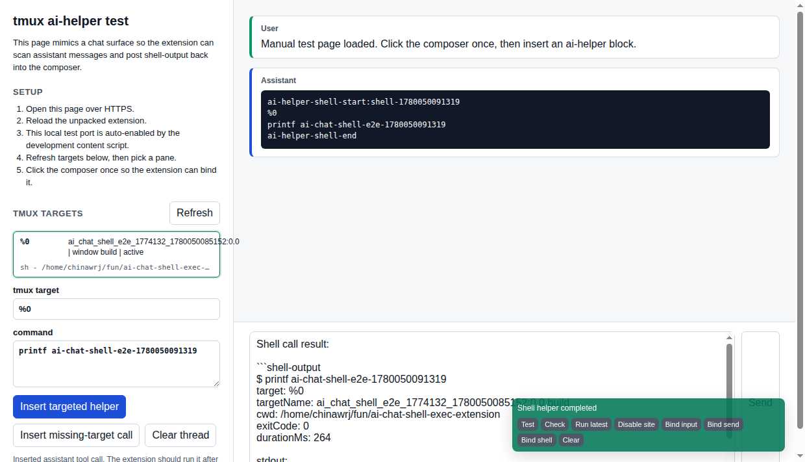
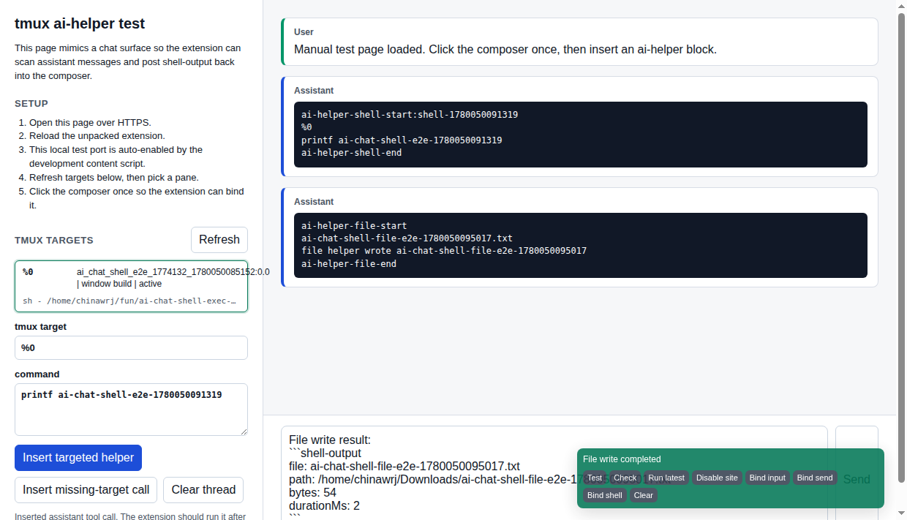

# AI Chat Shell Exec

Chrome extension for explicit local command execution from AI chat pages such as `https://chatgpt.com/` and `https://claude.ai/`, routed through a selected tmux pane.

This is local remote-code execution for AI chat. Install it only on machines you control, and only use it with conversations and models you trust enough to request local shell commands.

With the AI-facing instructions in this repo, the AI asks its human helper for local terminal output by returning an explicit plain text block. The first line is `ai-helper-shell-start`, the second line is the tmux target, the following lines are the command, and the block ends with `ai-helper-shell-end`:

```text
ai-helper-shell-start
%24
pwd && ls -la
ai-helper-shell-end
```

It can also ask the human helper to write a file under `$HOME/Downloads`. The first line is `ai-helper-file-start`, the second line is the file name, the following lines are the exact file content, and the block ends with `ai-helper-file-end`. The end marker is not written into the file.

For intentional repeated requests with the same payload, the AI may add a simple no-space identity suffix to the start marker, such as `ai-helper-shell-start:2` or `ai-helper-file-start:2`.

The content script waits until the assistant stops streaming, sends the command through the extension background worker to a local WebSocket server, the server sends it into the selected tmux pane, then the content script posts the captured pane output back into the chat composer as a `shell-output` block.

## Latest Screenshots

Shell helper result reply:



File helper result reply:



## Architecture

Chrome extensions cannot directly execute local shell commands. This project uses:

- `extension/`: Manifest V3 Chrome extension injected on HTTPS pages. The execution trigger is still limited to explicit ai-helper blocks.
- `server/`: Local WebSocket server bound to `127.0.0.1:17371` that lists tmux panes, sends commands into a selected pane, and captures output between completion markers.

Flow:

`AI chat page -> content script -> extension background -> ws://127.0.0.1:17371/shell -> tmux pane -> shell-output reply`

## Install

Prerequisites:

- macOS or Ubuntu
- Chrome or another Chromium browser with unpacked extensions enabled
- Node.js available on `PATH`
- tmux available on `PATH`

Download the latest release from:

`https://github.com/chinawrj/ai-chat-shell-exec-extension/releases`

If you use the release source archive, unzip it and run the commands below from the extracted project directory. If you clone the repository, use the repository root.

1. Open `chrome://extensions`.
2. Enable Developer mode.
3. Click Load unpacked and choose either the project root or the `extension/` subdirectory.

4. Confirm the extension ID is:

   `lkmeogidbglhedgekjgbpbfjkpapnhke`

5. Start the local shell server.

   On macOS, install and start the LaunchAgent:

   ```sh
   ./scripts/install_shell_server_agent.sh
   ```

   This creates `~/Library/LaunchAgents/com.local.ai-chat-shell-exec-server.plist`, starts the server now, and keeps it running after login. Logs are written under `.state/`. The installer also sets `AI_CHAT_SHELL_TMUX_SOCKET` to the default user tmux socket; override it before running the installer if you use a named tmux socket.

   On Ubuntu, or for a temporary foreground server during development, use:

   ```sh
   ./scripts/start_shell_server.sh
   ```

6. Reload the extension and reload the AI chat page.

After every extension code change, click Reload on the unpacked extension in `chrome://extensions`, then refresh each AI chat tab. Otherwise Chrome will keep running the old content script.

## Configure AI Instructions

For stable tool use, add human-helper instructions to the AI chat system you use. Put them in the chat system's custom instructions, project instructions, agent instructions, or the first message of a conversation. The AI-facing wording should say that you, the human, will serve helper blocks and return `shell-output`; it should not describe the format as an automatic script interface.

Start with:

`docs/AI_INSTRUCTIONS.md`

The short version is:

```text
I can act as your human helper for local terminal output and helper files. When local terminal output would help, ask me by replying with exactly one plain text shell helper block and no prose. The first line must be ai-helper-shell-start, the second line must be the tmux target, the following lines must be the command, and the final line must be ai-helper-shell-end. When writing a helper file would be useful, ask me with exactly one file helper block and no prose. The first line must be ai-helper-file-start, the second line must be a single file name, the following lines must be the exact file content, and the final line must be ai-helper-file-end. If I ask you to repeat an identical helper request as a new request, add a simple no-space suffix to the start marker, such as ai-helper-shell-start:2 or ai-helper-file-start:2. After I send back shell-output, use that output to continue. Do not repeat the same command after receiving shell-output.
```

Then run the floating panel's `Test` button once on each AI chat site.

The toolbar popup shows whether the local server is reachable and lets you change:

- enabled/paused
- auto-enabled sites
- available tmux targets to put on the second line of an ai-helper shell block
- auto-send shell results
- per-command browser confirmation
- timeout, output cap, and automatic chain limit
- export/import settings and per-origin calibration bindings

On an enabled chat site, click the chat input once. The content script remembers the composer selector for that origin and uses it for later `shell-output` replies.

By default, shell scanning is auto-enabled on `chatgpt.com` and `m365.cloud.microsoft`. On every other site, the extension does not inject page UI, scan content, or bind page events until you add the hostname in the toolbar popup.

The floating status panel also has calibration controls for unknown chat systems:

- `Test`: insert and send a full-chain self-test prompt. The prompt asks the AI to return an ai-helper shell block; the extension only treats the test as passed when the executed command and `stdout` contain that test's token. Unexpected helper blocks are ignored instead of being run.
- `Check`: verify local shell server health and show whether input/send/shell bindings exist for the current origin.
- `Run latest`: manually recheck the current page once and execute the latest helper block, ignoring automatic scan limits and duplicate suppression.
- `Bind input`: click it, then click the page's chat input.
- `Bind send`: click it, then click the page's send control.
- `Bind shell`: click it, then click a rendered helper/code block area.
- `Clear`: remove the saved bindings for the current origin.

Drag the panel title to move the floating window. You can also click a bind mode and drag the relevant page element onto the panel when the page supports dragging. Bindings and panel position are stored per origin, so a calibration for one site does not affect another.

Use the popup's portable config area to move settings and bindings to another Chrome profile or machine. It exports only extension settings and calibration selectors; it does not export shell command ledgers or page content.

## Tool Call Format

Plain command blocks are rejected because the server no longer chooses a shell by itself. The AI-facing format is a request to the human helper, and the extension recognizes only this shell helper block shape:

```text
ai-helper-shell-start
%24
uname -a
ai-helper-shell-end
```

`target` can be a tmux pane id such as `%24`, a `session:window.pane` address such as `espcam:0.0`, or a unique window name such as `build`.

When the extension returns a target list, each line is formatted for the AI to read, for example `target=%24 address=espcam:0.0 window=build command=zsh cwd=/path active=true`. Choose the `target=` value that matches the desired `window=...`.

Keep AI requests minimal by default:

```text
ai-helper-shell-start
%24
git status --short
ai-helper-shell-end
```

If the desired window name is unique, this also works:

```text
ai-helper-shell-start
build
git status --short
ai-helper-shell-end
```

The shell helper format maps only the second line to `target` and the remaining body to `cmd`. Legacy JSON shell-call requests and the old `ai-helper-start-shell` / `ai-helper-end-shell` aliases are not supported.

The start marker can include an optional helper identity suffix, for example `ai-helper-shell-start:20260529-1` or `ai-helper-file-start:20260529-1`. Use a simple no-space nonce, number, or timestamp when an otherwise identical helper payload should be treated as a new request. Without a suffix, the extension derives a stable identity from the plain text helper payload.

To write a file under `$HOME/Downloads`, use:

```text
ai-helper-file-start
notes.txt
first line
second line with "quotes" and {json}
ai-helper-file-end
```

The file helper format maps the second line to the file name and writes every following line up to, but not including, `ai-helper-file-end`.

## Zero-Knowledge Site Strategy

The extension does not hard-code a ChatGPT, Claude, or Copilot DOM contract. The default strategy is:

- detect editable chat inputs from standard browser semantics such as `textarea`, `input`, `contenteditable`, and `role="textbox"`;
- detect tool requests from explicit `ai-helper-shell-start`/`ai-helper-shell-end` and `ai-helper-file-start`/`ai-helper-file-end` blocks;
- post results by writing into the remembered editable input;
- submit first through generic form submission and synthetic Enter key events;
- fall back to a saved user-bound send control, then broad send-button heuristics if needed.

For sites with unusual editors or send controls, use the floating panel to bind the input, send control, or helper display area.

## Safety Defaults

- The extension runs only explicit `ai-helper-shell-start`/`ai-helper-shell-end` shell blocks and `ai-helper-file-start`/`ai-helper-file-end` file blocks. Ordinary `bash`, `sh`, `zsh`, `shell`, and JSON code blocks are not executable tool requests.
- Every command must name a tmux target. Missing or unknown targets are rejected and the reply lists available panes.
- File helper blocks write only a single file name directly under `$HOME/Downloads`; path separators and traversal are rejected.
- The default auto-enabled host list contains `chatgpt.com` and `m365.cloud.microsoft`; every other site requires an explicit per-site opt-in before scanning can run.
- Browser confirmation is off by default for hands-free operation. Set `requireApproval` to `true` in extension storage if you want a prompt before each command.
- The extension and server reject obvious copied `shell-output` text, terminal prompts such as `$ ...`, and markdown wrappers before execution.
- Automatic chained helper calls are capped by `maxChainCalls` in extension storage. The default is 100, and the popup enforces only a minimum of 1. New human prompts reset the chain count; tool result replies do not.
- Duplicate execution is blocked before the command reaches the local server. The content script generates a stable call key from the site, latest human intent, tmux target, command, cwd, timeout, and output cap; the background worker claims that key with an internal sequence number. The local server keeps a second persistent ledger in `.state/shell-ledger.json`, so refreshing a chat page or reloading the extension does not rerun an already completed call.
- The WebSocket server only accepts Chrome extension requests by default. Set `AI_CHAT_SHELL_ALLOW_UNTRUSTED_ORIGINS=1` only for local development tests.
- The local server clamps timeout to 1 second through 10 minutes. When a tmux command times out, the server stops waiting and reports that the command may still be running in the pane.
- Commands longer than 8000 characters are rejected before execution.
- Output is capped to avoid flooding the page.
- Repeated shell output loops are suppressed when the assistant repeats the same command after receiving a shell-output reply.
- A small status badge appears in the lower-right corner while the content script is active.

Treat shell calls as remote code execution on your machine. Review the security notes in `SECURITY.md` before sharing this with other users.

## Development Loop

After changing extension files:

1. Reload the unpacked extension in `chrome://extensions`.
2. Refresh every AI chat tab you want to use.
3. Confirm the lower-right status badge shows the latest content script version.

After changing server files with the LaunchAgent installed:

```sh
./scripts/install_shell_server_agent.sh
```

For foreground development:

1. Stop the old shell server.
2. Start it again:

   ```sh
   ./scripts/start_shell_server.sh
   ```

Health check:

```sh
curl http://127.0.0.1:17371/health
```

Manual tmux test page:

```sh
node scripts/start_tmux_test_page_https.js
```

Open `https://localhost:17443/tmux-test-page.html`, accept the local certificate warning, reload the unpacked extension, copy a tmux target from the popup, click the page composer once, then insert a targeted helper block. This local test port is auto-enabled by the development content script.

To launch an isolated Chromium-family test profile with this unpacked extension already loaded:

```sh
./scripts/open_tmux_test_chrome.sh
```

The helper prefers Chrome for Testing, Chromium, then Microsoft Edge before Google Chrome. Recent Google Chrome builds can ignore `--load-extension` for local unpacked extensions; in that case load `extension/` manually from `chrome://extensions` or set `AI_SHELL_TEST_BROWSER_APP`.

Installation diagnostics:

```sh
./scripts/doctor.sh
```

Full automated checks, including the Chrome extension e2e test:

```sh
./scripts/test_all.sh
```

The Chrome extension e2e test launches a real Chromium-family browser with the unpacked extension, starts the local tmux test page and shell server when needed, inserts an ai-helper block, and verifies the returned `shell-output`. It works on macOS with Chrome for Testing/Chromium/Chrome and on Ubuntu with a display, Xvfb, or a cached Playwright Chromium browser under `~/.cache/ms-playwright`. Set `CHROME_BIN` to force a browser binary.

Feature and test coverage is tracked in `docs/FEATURE_TEST_MATRIX.md`. Add or update a row there whenever a feature or test case changes.

Uninstall the LaunchAgent:

```sh
./scripts/uninstall_shell_server_agent.sh
```

Build release archives:

```sh
./scripts/package_release.sh
```

## License

MIT
