# AI Chat Shell Exec

Chrome extension for explicit local command execution from AI chat pages such as `https://chatgpt.com/` and manually enabled sites like `https://claude.ai/`, routed through the default `ForAI:host` tmux pane.

This is local remote-code execution for AI chat. Install it only on machines you control, and only use it with conversations and models you trust enough to request local shell commands.

With the AI-facing instructions in this repo, the AI asks its human helper by returning exactly one explicit fenced code block and no prose. The extension recognizes eight helper block types:

- Shell helper: request local terminal output from the default `ForAI` tmux session.
- Board helper: send one command line to the `ForAI` `board` tmux window or the configured board tmux pane.
- File helper: write one file under `AI_HELPER_FILE_PATH`, or `$HOME/Downloads` when the environment variable is absent.
- Draw.io helper: preview a complete native `.drawio` XML file locally as SVG without contacting the shell server or composer.
- Agent message helper: send a task or result to another locally registered agent tab.
- Agent roster helper: let an AI master query online agents before delegating.
- Agent task-status helper: let an AI master check a delegated task by `message-id` or `task-id`.
- Skill helper: list or load local Claude Code-style `SKILL.md` instructions and acknowledge a fixed AI memory catalog without running tmux commands.

Shell helper:

````
ai-helper-shell-start
pwd && ls -la
ai-helper-shell-end
````

Board helper:

````
ai-helper-board-start
version
ai-helper-board-end
````

File helper:

````
ai-helper-file-start
notes.txt
first line
second line
ai-helper-file-end
````

Draw.io helper:

````
ai-helper-drawio-start
<mxfile>
  <diagram name="Architecture">
    <mxGraphModel>...</mxGraphModel>
  </diagram>
</mxfile>
ai-helper-drawio-end
````

The Draw.io helper body is the file itself, not a command. After streaming settles, the extension makes the last complete helper the sole current outcome in a movable/resizable floating preview. A valid helper replaces the preview with its SVG; a malformed or renderer-failing helper clears the previous SVG/download and exposes only its bounded error log. Rendering uses a pinned packaged viewer in a sandboxed extension iframe, never tmux or the local WebSocket server. Success stays silent, while failure uses the durable composer-delivery path for one bounded error report.

Agent message helper:

````
ai-helper-agent-message-start
to: slave-a
task-id: task-001

Investigate this independently and report back.
ai-helper-agent-message-end
````

Agent roster helper:

````
ai-helper-agent-roster-start
role: slave
ai-helper-agent-roster-end
````

Agent task-status helper:

````
ai-helper-agent-task-status-start
message-id: msg-001
ai-helper-agent-task-status-end
````

Skill load helper:

````
ai-helper-skill-start
cmd: load
skill-id: exact-id-from-memory
catalog-sha: complete-catalog-sha-from-memory
ai-helper-skill-end
````

By default, shell helpers run in the `host` window of the `ForAI` tmux session. The local server creates the `ForAI` session plus `host` and `board` windows when the page plugin starts or when tmux targets are listed. New default windows start in the project root; set `AI_CHAT_SHELL_FORAI_CWD=/path/to/workspace` before starting the server to choose another default cwd. The board helper body is exactly one command line and defaults to the `ForAI` `board` window, or `AI_CHAT_SHELL_BOARD_TARGET` when set. A named board marker such as `ai-helper-board-R1-start` targets `ForAI:board-R1` when no environment override is set. The file helper's second line is a single file name, and the remaining lines are the exact file content. The file end marker is not written into the file. File helpers write directly under `$HOME/Downloads` unless `AI_HELPER_FILE_PATH` exists in the shell server environment; set it to a non-empty directory path to replace the default destination.

Set `AI_CHAT_SHELL_ENV_FILE=/absolute/path/to/runtime.env` before starting the shell server to inject a controlled environment into **ai-helper shell commands, Skill `install.sh`/`uninstall.sh`, and Skill load substitution**. The server rereads the file immediately before every command, lifecycle execution, or Skill load, so editing its contents does not require a restart. The accepted format is one `NAME=VALUE` or `export NAME=VALUE` declaration per line, with blank lines and `#` comment lines allowed; single-quoted values are literal and double-quoted values support `\\`, `\"`, `\n`, `\r`, and `\t`. The file is parsed as data and is never sourced or command-expanded. It must be a real, non-symlinked, valid UTF-8 regular file no larger than 256 KiB, with at most 512 unique POSIX-style names and 64 KiB per value. Empty paths, duplicate/invalid names, malformed quoting, unsafe files, and exceeded limits fail the requested operation before it starts. The configured values are not added to server health, logs, ledgers, board/file helpers, or the server process environment. During Skill load, only values referenced by placeholders in the installed `SKILL.md` enter the bounded load result sent to the AI; unreferenced env-file values remain absent. A shell command, lifecycle script, or loaded Skill can therefore deliberately disclose a value it receives, so protect the file accordingly. Shell duplicate adjudication includes the exact environment-file content SHA: an unchanged command/file snapshot may deduplicate after proven completion, while changing the file makes the same command eligible to execute again. Env-file changes do not alter the raw Skill catalog SHA or version.

The Skill catalog defaults to `$HOME/.claude/skills`. Set `AI_HELPER_SKILL_PATHS` before starting the shell server to scan one or more other roots recursively; separate roots with the platform path delimiter (`:` on macOS/Linux, `;` on Windows) or newlines. `AI_HELPER_SKILL_PATH` is accepted for one root. Each Skill must have a real, non-symlinked UTF-8 `SKILL.md` with Claude Code-style YAML `name` and `description` frontmatter, and names must be unique across all roots.

Discovered Skills are **uninstalled by default**. `View Skills` always shows one row for every successfully discovered Skill; installation is never a list filter, only per-row state. Each row shows `Install`, `Installing…`, `Uninstall`, `Uninstalling…`, `Installed`, retry, or a missing-script state. Invalid Skill files remain visible as diagnostics without hiding valid rows. An open list automatically follows catalog version/SHA/count changes made by another tab and rejects stale refresh responses. A partial or invalid scan is read-only: it cannot erase authenticated installed receipts, so temporarily unavailable roots recover their prior state when they return. Installation is available only when a real, non-symlinked `install.sh` sits beside `SKILL.md`; an installed Skill is removable only when an equally safe adjacent `uninstall.sh` exists. Both operations require a trusted browser click plus a native confirmation, bind the exact Skill/catalog/script SHA values, serialize through one lifecycle queue, execute a private immutable `/bin/sh` snapshot from the Skill directory, and remove it afterward. Their base environment remains minimal; values from the optional `AI_CHAT_SHELL_ENV_FILE` are overlaid only for the lifecycle subprocess. Neither operation has a fixed total-duration cutoff: the process group is terminated only after **600 consecutive seconds with no stdout or stderr**, and either stream resets that idle clock even after the diagnostic capture limit is reached. The extension keeps these long WebSockets alive without a shorter browser watchdog. Only explicit exit code `0` with no signal/idle timeout changes lifecycle state. Installation additionally requires fresh unchanged Skill/installer proofs. A successful immutable uninstaller atomically clears the exact installed record before the catalog is refreshed, so even a lifecycle file changed by that script cannot produce a false failure while silently disappearing from the AI catalog. Nonzero, signal, and idle-timeout failures do not proactively clear an unchanged installed identity. If a failed script or concurrent writer changed `SKILL.md` or `install.sh`, normal fail-closed reconciliation still resets that new identity to uninstalled rather than transferring the old authenticated receipt. Diagnostics open a bounded one-use `chrome-extension://` result window; raw output never enters the chat page DOM, composer, AI messages, ledgers, logs, or persistent extension storage. Skill helpers and AI responses cannot invoke install or uninstall, and neither operation touches tmux, Force run, or shell duplicate ledgers.

Installation state is stored as mode-0600 schema-v2 JSON at the fixed file `skill-install-state.json` under `AI_CHAT_SHELL_STATE_DIR` (normally `.state/`). Each discovered Skill records its current Skill SHA, installer SHA, installed field, and—only after a successful server-run installer—a server-authenticated receipt backed by the private `skill-install-receipt.key`. Adding or deleting a Skill refreshes the JSON; changing `SKILL.md` or `install.sh` resets that Skill to uninstalled. The raw catalog SHA remains the aggregate SHA of all discovered `SKILL.md` files—there is no effective SHA. The monotonic catalog version also advances when the effective installed set or another meaningful validated installation-state record changes, so the Skills chip turns green even when the raw SHA is unchanged. Formatting, field order, or `updatedAt`-only changes do not create false updates; malformed, mismatched, or manually forged installed state fails closed and is repaired to uninstalled.

Only installed Skills appear in the catalog sent to AI or can be loaded. Every synchronized entry contains the full `id`, `name`, `description`, and raw Skill SHA; the prompt explicitly requires the AI to retain descriptions as routing metadata in the single `AI_CHAT_SHELL_SKILLS_CATALOG` memory entry. The AI must echo both `catalog-sha` and `catalog-version` in its ACK, and the extension validates both against the challenged list and a fresh server scan. Automatic status polling reuses a 10-second server snapshot so multiple tabs do not repeatedly block shell work; `View Skills`, `Rescan`, sync list/ACK validation, installation, and loads force a fresh bounded scan.

The source release includes a runtime-root-neutral `skill-creator` at `skills/skill-creator/`. Copy that directory, including `install.sh`, into a persistent writable Skill root, then set `AI_HELPER_SKILL_PATH` to that root (or include it in `AI_HELPER_SKILL_PATHS`) before starting the shell server. Open `View Skills` and install it before synchronizing the AI catalog. Avoid using a checkout or extracted release directory as the long-lived writable root: upgrades should not delete user-created Skills or dirty the repository. When loaded, the shell server injects the authoritative resolved roots and configuration source into its instructions; the AI does not guess from tmux or browser environment. New Skills produced by `skill-creator` include their own deterministic installer and remain unavailable until the user explicitly installs them from the extension. Because installers execute from an immutable snapshot whose cwd is the Skill directory, generated installers use `$PWD` or cwd-relative paths and never derive the Skill directory from `$0`.

Catalog discovery accepts at most 64 configured roots, 10,000 visited directory entries, 500 files, directory depth 12, 384 KiB per `SKILL.md`, and 32 MiB across the configured roots. Traversal and public diagnostics are each capped at 100 entries with an explicit omission/stop sentinel. The actual pretty-printed catalog JSON must stay within 350,000 characters so the complete list and closing response contract always fit the durable composer-delivery bound. An exceeded boundary makes the whole catalog unhealthy; the plugin never acknowledges or silently truncates a partial catalog.

An environment-expanded Skill body is capped at 450 KiB of JavaScript characters. Before returning a successful load, the server also constructs the exact dynamic Markdown-fence shape used by the extension and requires the complete composer reply to fit within 500,000 characters. The extension verifies that exact count again; a fence-amplified or formatter-mismatched body fails closed instead of entering the generic persistence truncation path.

Environment substitution happens only during `cmd: load`; it never changes the raw file SHA or catalog version. Every valid variable named in `AI_CHAT_SHELL_ENV_FILE` is automatically eligible for expansion and overrides a same-named shell-server process value, so it does not need to be repeated in `AI_HELPER_SKILL_ENV_ALLOWLIST`. For additional process-environment values, `HOME`, `USER`, `LOGNAME`, `SHELL`, and `TMPDIR` are allowed by default and `AI_HELPER_SKILL_ENV_ALLOWLIST=NAME_A,NAME_B` adds explicit names. Non-allowlisted process variables and Claude runtime placeholders stay literal, an allowlisted-but-missing variable fails the load instead of becoming empty, and `${CLAUDE_SKILL_DIR}` resolves to the validated Skill directory. The server-owned `${AI_HELPER_SKILL_ROOTS_JSON}` and `${AI_HELPER_SKILL_ROOT_SOURCE}` placeholders expose the already-resolved catalog-root configuration; env-file and process values cannot spoof them. Expansion is one-pass and built incrementally against the 450 KiB loaded-body limit, so replacement text is never expanded again and repeated large placeholders fail before a large intermediate string is allocated. Loading never executes backticks, `$()` expressions, or Claude dynamic-context commands.

For intentional repeated requests with the same payload, the AI may add a simple no-space identity suffix to the start marker, such as `ai-helper-shell-start:2`, `ai-helper-board-start:2`, `ai-helper-board-R1-start:2`, `ai-helper-file-start:2`, `ai-helper-drawio-start:2`, `ai-helper-agent-message-start:2`, `ai-helper-agent-roster-start:2`, or `ai-helper-agent-task-status-start:2`.

For executable/file helpers, the content script waits until the assistant stops streaming, sends the request through the extension background worker to a local WebSocket server, then posts the captured output back into the chat composer as a `shell-output` block. Draw.io rendering remains entirely local and never contacts the shell backend: the last complete helper alone controls the preview, success stays silent, and a validation/render failure clears the old SVG, keeps only the latest error, and sends one bounded error report through the same reliable composer-delivery path. The preview includes Maximize/Restore for browser-viewport viewing. Backend duplicate-control metadata is never posted to the model: an already-presented result is handled only in the local panel, while an execution whose result was never presented may be restored as a clean original result without `duplicate`, `skipped`, replay, or reason fields.

## Latest Extension Panel Screenshots

The panel is state-driven: it keeps the healthy idle view minimal and reveals an action only when that action is relevant. Its unchanged charcoal background means idle, deep blue means an end-to-end helper operation is still in progress, deep green means completion, and deep red means failure or another actionable exception. The status dot, text, and accessibility label repeat the same meaning so color is never the only signal. These images are cropped automatically from the real unpacked-extension Chrome E2E flow rather than composed mockups.

| Healthy idle | Skills update available |
| --- | --- |
| 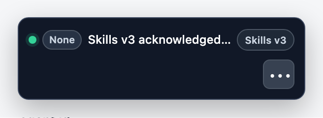 | 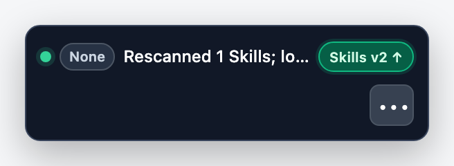 |
| The acknowledged `Skills vN` chip stays neutral but remains clickable to open the local catalog; the compact role badge shows the saved `None`, `Master`, or `Slave` routing state. | A changed local catalog turns the version chip into the green synchronization action. |

| Force run available |
| --- |
| 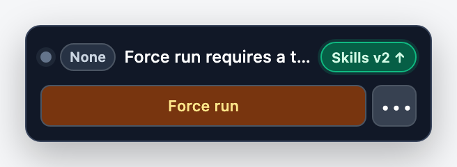 |
| After the latest detected executable or Skill helper has accumulated 20 seconds of real idle time, `Force run` appears as a compact recovery fallback. Repeated scans and semantic-equivalent DOM redraws do not restart that clock; a real helper/backend execution pauses it. |

| Shell helper running | Waiting for user decision |
| --- | --- |
| 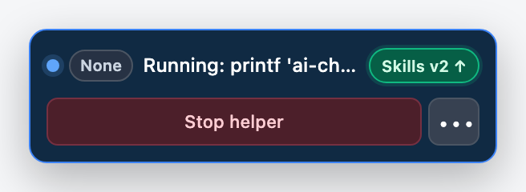 | 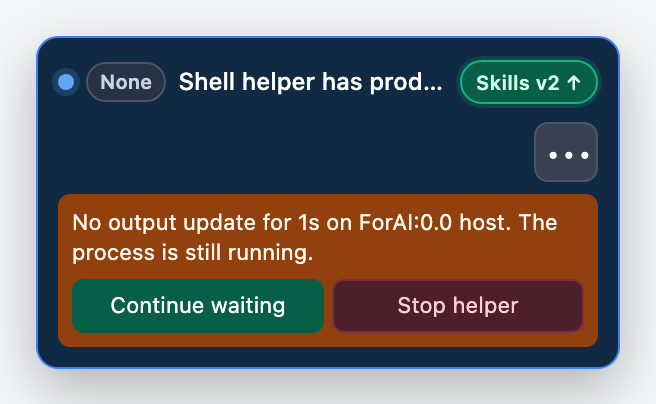 |
| During execution, the deep-blue panel shows that work remains in progress and `Stop helper` replaces `Force run`. | Output-idle is still an active execution: the panel remains blue while `Continue waiting` and `Stop helper` appear together in the decision card. |

| Helper completed | Helper failed |
| --- | --- |
|  | 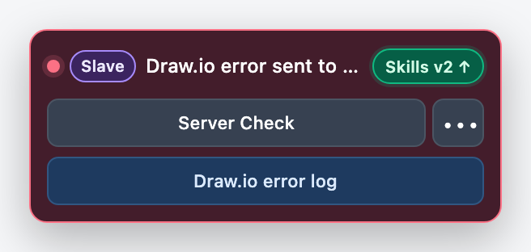 |
| Green is retained after a user-visible successful completion; Ctrl+C after execution started is also a completed execution and uses this state. | Red appears immediately for failures and protocol/render exceptions, including while a bounded error reply is still waiting for composer delivery. |

| Draw.io available |
| --- |
| 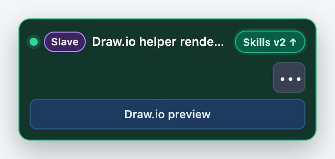 |
| `Draw.io preview` appears only after a preview artifact or render error exists and remains available after closing the preview. |

### Expanded advanced controls

`More` reveals the complete setup/recovery, Agent/tmux-ai, Skills, full-status, debug, and page-binding controls without making them occupy the normal chat view. Page binding is the last group and stays folded until its native summary is opened.

| Advanced controls | Page binding at the bottom |
| --- | --- |
| 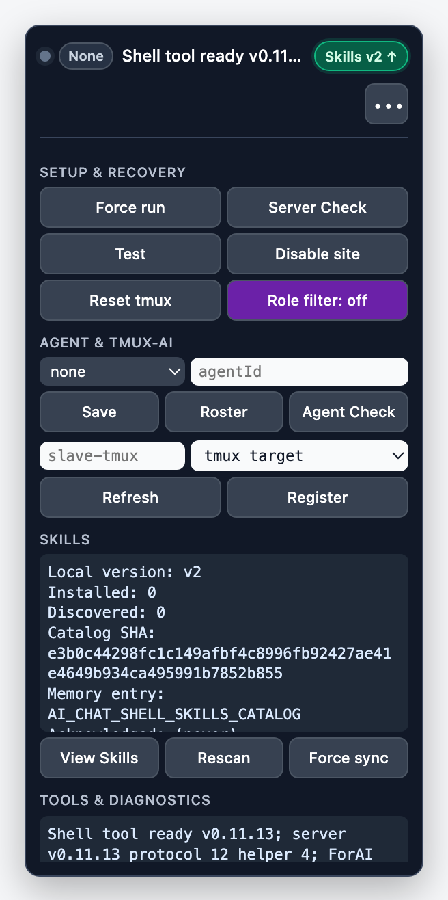 | 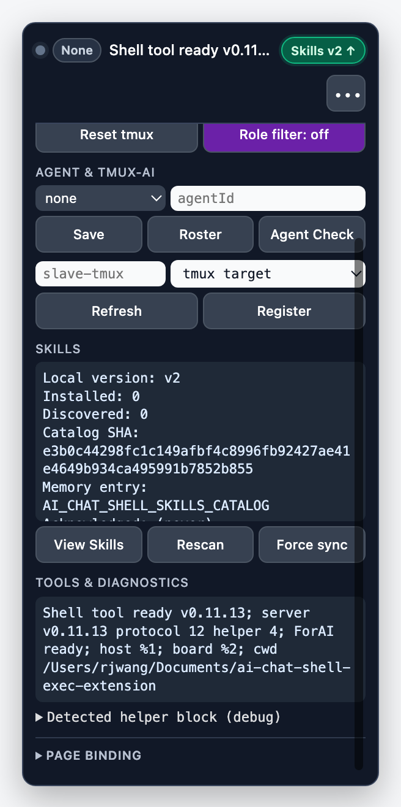 |

## Basic Helper Screenshots

These older screenshots show the basic shell/file helper reply shape. Multi-agent controls are described below.

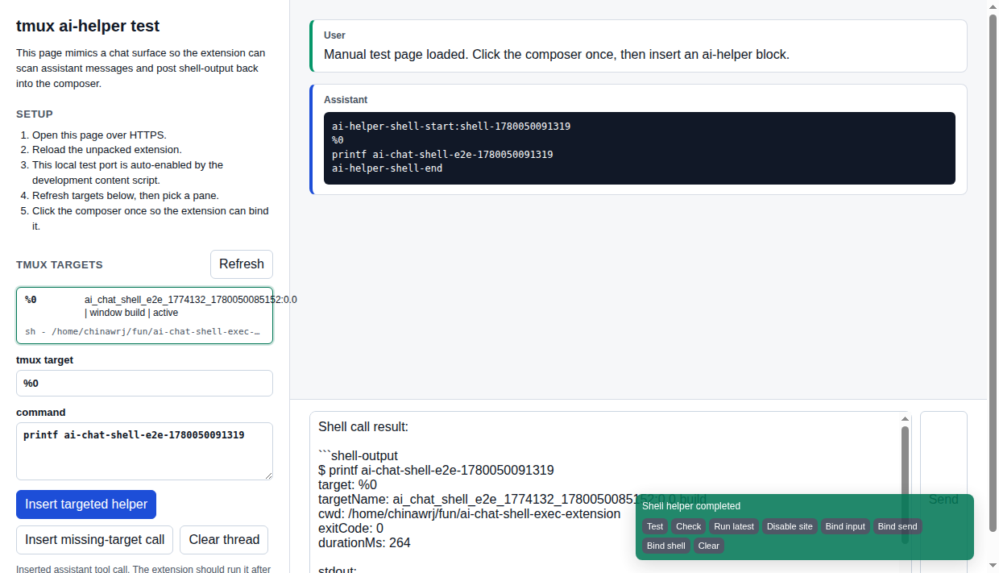

File helper result reply:

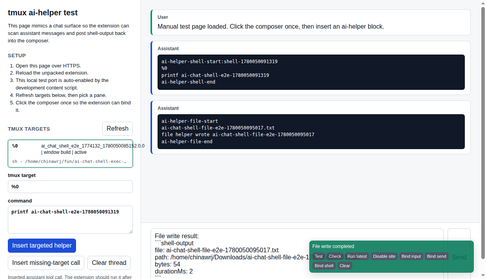

## Architecture

Chrome extensions cannot directly execute local shell commands. This project uses:

- `extension/`: Manifest V3 Chrome extension injected on HTTPS pages. Executable requests remain limited to explicit shell/board/file/agent helpers; complete Draw.io helpers take a separate local-only sandboxed preview path, while Skill helpers use a dedicated non-tmux catalog protocol.
- `server/`: Local WebSocket server bound to `127.0.0.1:17371` that ensures the default `ForAI` tmux workspace, sends shell commands into `ForAI:host`, sends board commands into the configured board pane, hosts the local in-memory agent hub, and safely scans/hashes/loads configured Skill roots.

Flow:

Executable helpers: `AI chat page -> content script -> extension background -> ws://127.0.0.1:17371/shell -> tmux pane or agent hub -> shell-output / agent-message reply`

Draw.io helpers: `AI chat page -> content script -> isolated packaged viewer iframe -> floating SVG preview for the user`

Skill helpers: `AI chat page -> content script -> extension background -> local Skill catalog API -> catalog/load response in the composer` (never tmux, shell ledger, or command duplicate control)

## Install

Prerequisites:

- macOS or Ubuntu
- Chrome 116+ or another compatible Chromium browser with unpacked extensions enabled
- Node.js available on `PATH`
- tmux available on `PATH`
- Claude Code CLI installed and logged in if you want to use a tmux-hosted Claude slave

Download the latest release from:

`https://github.com/chinawrj/ai-chat-shell-exec-extension/releases`

If you use the release source archive, unzip it and run the commands below from the extracted project directory. If you clone the repository, use the repository root.

1. Open `chrome://extensions`.
2. Enable Developer mode.
3. Click Load unpacked and choose either the project root or the `extension/` subdirectory.

4. Confirm the extension ID is:

   `lkmeogidbglhedgekjgbpbfjkpapnhke`

5. Start the local shell server in a terminal and leave it running while using the extension.

   ```sh
   ./scripts/start_shell_server.sh
   ```

   Runtime state and server logs default to `.state/` under this project directory. Set `AI_CHAT_SHELL_STATE_DIR=/path/to/state` only if you intentionally want runtime state elsewhere. If you use a named tmux socket, set `AI_CHAT_SHELL_TMUX_SOCKET` before starting the server.

   To place file-helper output somewhere other than Downloads, set the destination before starting the server:

   ```sh
   AI_HELPER_FILE_PATH=/path/to/helper-files ./scripts/start_shell_server.sh
   ```

   For compatibility with older setup instructions, `./scripts/install_shell_server_agent.sh` first removes any legacy macOS LaunchAgent and then starts the same foreground server. It does not install auto-start.

6. Reload the extension and reload the AI chat page.

After every extension code change, click Reload on the unpacked extension in `chrome://extensions`, then refresh each AI chat tab. Otherwise Chrome will keep running the old content script.

## Configure AI Instructions

For stable tool use, add human-helper instructions to the AI chat system you use. Put them in the chat system's custom instructions, project instructions, agent instructions, or the first message of a conversation. The AI-facing wording should say that you, the human, will serve helper blocks and return `shell-output`; it should not describe the format as an automatic script interface.

For one complete instruction set that can be pasted directly into a chat product's Custom Instructions, use:

`docs/AI_INSTRUCTIONS_FULL.md`

For shorter and role-specific alternatives, see:

`docs/AI_INSTRUCTIONS.md`

The short version is:

`````text
I can act as your human helper for local terminal output, board output, helper files, and local diagram previews.

When output would help, reply with exactly one fenced code block and no prose.

For local terminal output, use:
````
ai-helper-shell-start
command here
ai-helper-shell-end
````

For board output, use:
````
ai-helper-board-start
one board command here
ai-helper-board-end
````

For writing one helper file under my configured helper-file directory, use:
````
ai-helper-file-start
filename.ext
exact file content here
ai-helper-file-end
````

For displaying a complete native Draw.io file locally, use:
````
ai-helper-drawio-start
<mxfile><diagram name="Architecture"><mxGraphModel>...</mxGraphModel></diagram></mxfile>
ai-helper-drawio-end
````

Rules:
- Use a plain unlabeled code fence (four backticks) exactly, with no text before or after the code block.
- Shell helpers do not include a tmux target; the entire helper body is the shell command and runs in the default `ForAI` `host` window.
- Board helpers must contain exactly one non-empty board command line and no target. Use `ai-helper-board-R1-start` / `ai-helper-board-R1-end` to send to the `ForAI:board-R1` window.
- File helpers must put a single file name, not a path, on the second line.
- Draw.io helpers contain the complete `.drawio` `<mxfile>` document itself. The last complete helper alone controls the local preview: success shows its SVG without a reply, while validation/render failure clears the SVG and returns a bounded error report. The diagram never goes to tmux, and you cannot see its render. Rely on my textual confirmation after success.
- A simple no-space suffix such as `ai-helper-shell-start:2` may be used as an optional request identity for diagnostics. It is not required for a new retry helper and does not force rerun a command that the server already executed on the resolved tmux pane.
- After I send back shell-output, use that output to continue.
- Do not repeat a command after shell-output confirms execution. A command explicitly reported as not executed may be retried with a new identical helper.
`````

Then run the floating panel's `Test` button once on each AI chat site. `Test` validates the basic shell-helper path; multi-agent and tmux-ai paths have separate smoke tests below.

The toolbar popup shows whether the local server is reachable and lets you change:

- enabled/paused
- auto-enabled sites
- local server release, server protocol, and helper protocol diagnostics
- visible tmux panes and default `ForAI` workspace state for diagnostics
- default `ForAI` host/board/cwd state, plus a reset button for the default session
- auto-send shell results
- per-command browser confirmation
- shell output-idle timeout, output cap, and automatic chain limit
- export/import settings and per-origin calibration bindings

On an enabled chat site, click the chat input once. The content script remembers the composer selector for that origin and uses it for later `shell-output` replies.

By default, shell scanning is auto-enabled on `chatgpt.com` and `m365.cloud.microsoft`. On every other site, including `claude.ai`, the extension does not inject page UI, scan content, or bind page events until you add the hostname in the toolbar popup. To enable a site, open the extension popup, add the hostname to enabled sites, save, then refresh that page.

New chats can receive their permanent URL while the first AI response is still rendering. The extension handles both ChatGPT's `/` to `/c/<id>` or `/uc/<id>` assignment and M365's `/chat` to `/chat/conversation/<UUID>` assignment without reloading its floating panel. The URL change only starts a reconciliation: the same latest user message, adjacent assistant response, exact helper, and live DOM ownership must still be present, and the assigned route must remain scan-stable for at least four seconds before an automatic backend start, preview commit, composer write, or send may continue. Generation-time proof also preserves a completed helper if the scanner is still awaiting local state/settings when the host performs only `pushState`; the extension schedules the settled rescan itself instead of waiting for another DOM mutation. A retained operation executes and submits once; an already-written exact M365 Lexical result resumes send-only. Transcript replacement, query/hash changes, copied replacement nodes, and permanent-conversation A-to-B navigation fail closed.

The floating status panel defaults to a compact, state-driven 292px bar so it does not cover the chat. It shows the local `Skills vN` chip beside the concise status; the chip becomes a highlighted green action only when the latest catalog has not been acknowledged. That header chip is never replaced by `Force run`. An error adds `Server Check`, and an unhandled assistant Skill helper that could not be proven live may expose the immediate `Process Skill` recovery action. If the latest detected executable or Skill helper remains without a real helper/backend operation for 20 accumulated seconds, the compact action becomes the generic `Force run` fallback. Repeated scans, unrelated composer/assistant activity, and semantic-equivalent DOM redraws do not restart the deadline; a real operation pauses and later resumes it. Active shell execution hides manual actions and shows `Stop helper`. Select `More` to reveal the controls in five groups:

- Setup & recovery: a permanently present `Force run` entry plus `Server Check`, `Test`, `Enable site`, `Reset tmux`, and `Role filter`. The permanent entry is disabled until an executable/Skill helper is detected and while a helper operation is running.
- Page binding: `Bind input`, `Bind send`, `Bind shell`, and `Clear`.
- Agent & tmux-ai: page role/id, `Save`, `Roster`, `Agent Check`, tmux target refresh, and registration.
- Skills: the full local version/SHA/ack status, `View Skills`, `Rescan`, and `Force sync`.
- Tools & diagnostics: the full untruncated status and the detected-helper debug view.

Clicking the green Skills chip starts one synchronization owner for the current AI-site origin. Other tabs on that origin show that another tab is handling it. The plugin sends a self-explanatory request that tells the AI which fixed memory entry to replace and, after the list is returned, the exact success/failure acknowledgement fields. Runtime prompts refer to the Skill helper delimiters indirectly so the plugin cannot scan its own prompt as a new helper. Only a matching latest catalog SHA, current challenge, fixed memory-entry name, scope, and owner tab clears the green update state. Accumulated local changes keep only the latest desired SHA; stale acknowledgements never clear it. `Force sync` creates a new challenge even when the SHA is unchanged or replaces a lost challenge owned by this same tab; another tab can never replace the active owner. `View Skills` stays local and never writes into the composer.

`Draw.io preview` is contextual instead of permanent: it is hidden when no Draw.io artifact or error exists, appears automatically after the first preview/error, and remains available to reopen a preview after Close.

The individual controls behave as follows:

- `Test`: insert and send a full-chain self-test prompt. The prompt asks the AI to return an ai-helper shell block; the extension only treats the test as passed when the executed command and `stdout` contain that test's token. Unexpected helper blocks are ignored instead of being run.
- `Server Check`: verify local shell server release/protocol/helper compatibility, `ForAI` host/board/cwd readiness, and whether input/send/shell bindings exist for the current origin.
- `Reset tmux`: recreate only this tab's active tmux session. Role `None` resets the default `ForAI`; `Master` or `Slave` resets that role's exact `ForAI-<agentId>` session without touching the default or other agents.
- `Force run`: after a real trusted browser click, manually recheck and process the latest detected executable or Skill helper. Host-page scripts and synthetic `.click()` events are rejected. For executable helpers it explicitly bypasses the shell server's completed-execution duplicate decision; for Skill helpers it re-enters only the validated Skill list/load/ACK protocol. The `More` entry is always discoverable, while the compact entry appears after the 20-second semantic-idle fallback deadline.
- `Process Skill`: after a real trusted browser click, manually process the latest eligible Skill helper through the validated Skill list/load/ACK protocol. Synthetic page events are rejected. It never executes shell, bypasses duplicate adjudication, or installs a Skill.
- `Stop helper`: terminate only the currently owned shell helper in this tab's active role workspace. It appears only while a helper is active. When a running helper produces no observable output for the configured idle timeout, the panel places `Continue waiting` and `Stop helper` side by side in the same decision card and hides the redundant upper Stop control. Continuing resets the idle clock.
- `Bind input`: click it, then click the page's chat input.
- `Bind send`: click it, then click the page's send control.
- `Bind shell`: click it, then click a rendered helper/code block area.
- `Clear`: remove the saved bindings for the current origin.
- Agent controls: choose `master` or `slave`, enter an agent id, click `Save`, use `Roster` to list online agents, and use `Agent Check` to explain whether this tab, the local agent hub, browser-tab slaves, tmux panes, and tmux-ai slaves are ready. The active role is tab-scoped and survives page refresh; opening another tab does not silently reuse it.
- Tmux AI controls: from a saved master page, click `Refresh`, select the tmux pane where the AI slave is already running, enter a slave id, then click `Register`.
- Skill controls: `View Skills` opens the local catalog without contacting the AI, `Rescan` refreshes configured roots, and `Force sync` asks the current tab's AI to replace `AI_CHAT_SHELL_SKILLS_CATALOG` again.

Drag the panel title to move the floating window. You can also click a bind mode and drag the relevant page element onto the panel when the page supports dragging. Bindings and panel position are stored per origin, so a calibration for one site does not affect another.

Use the popup's portable config area to move settings and bindings to another Chrome profile or machine. It exports only extension settings and calibration selectors; it does not export shell command ledgers or page content.

## Local Multi-Agent Tabs

The floating panel can register an enabled page as a local agent. Set a role (`master` or `slave`) and an `agentId`, then click `Save`. Selecting a role suggests a usable default id (`master` for a master tab and a tab-local `slave-*` id for a slave tab).

### Browser-Tab Quick Start

Typical browser-tab workflow:

1. Open an enabled master chat page, refresh it after changing extension settings, click the chat input once if the floating panel is not calibrated, set role `master`, keep or edit the id, then click `Save`.
2. Open one or more enabled slave chat pages, refresh them after changing extension settings, set role `slave`, use stable ids such as `slave-a`, then click `Save` on each.
3. On the master page, click `Agent Check` or `Roster` if you want human-readable diagnostics. The master AI can also query the same roster itself with the helper block below.
4. Put the master instructions from `docs/AI_INSTRUCTIONS.md` in the master chat. Put the slave instructions in each slave chat.

`Roster` lists agents currently registered with the local server and pending message counts. `Agent Check` explains common setup problems directly in the floating panel, such as an unsaved current tab, no browser-tab slave, no tmux-ai slave, a stale tmux-ai pane, or an unavailable local server. Browser-tab slaves are enough for browser-only workflows; tmux-ai is optional. These panel buttons are for human debugging; AI masters should use the read-only agent roster and task-status helpers.

Minimal master prompt to paste into the master chat:

`````text
You are the master agent. Before delegating, discover online teammates by sending exactly one roster helper block and no prose:

````
ai-helper-agent-roster-start
role: slave
ai-helper-agent-roster-end
````

Read the Agent roster result. Choose an agent with role=slave and canReceiveTask=true. When I ask you to delegate work to a teammate, send exactly one agent-message helper block and no prose:

````
ai-helper-agent-message-start
to: exact-slave-id-from-roster
task-id: task-unique-id

Specific task instructions for the slave.
ai-helper-agent-message-end
````

After sending a task, keep the returned messageId. If the task takes too long, query status with:

````
ai-helper-agent-task-status-start
message-id: message-id-from-agent-message-result
ai-helper-agent-task-status-end
````

Include enough context for the slave. Wait for the slave result before final synthesis.
`````

Minimal browser-slave prompt to paste into each browser slave chat:

`````text
You are a slave agent. When a master task is delivered, work only on that task. If you need local terminal output, request it with the normal ai-helper-shell block.

When finished, reply with exactly one agent-message helper block and no prose:

````
ai-helper-agent-message-start
to: master
task-id: task-id-from-master
reply-to: message-id-from-master

Result, findings, tests run, and blockers.
ai-helper-agent-message-end
````

Preserve `reply-to` exactly when the delivered task includes it.
`````

Agent pages can query online teammates and task state through the local WebSocket agent hub:

````
ai-helper-agent-roster-start
role: slave
ai-helper-agent-roster-end
````

The roster output includes `agentId`, `role`, `surface`, `replyMode`, `pending`, `canReceiveTask`, `lastSeenAgeMs`, and `capabilities`. `surface=web` means the slave is another browser tab; `surface=tmux-ai` means the slave is an AI running in tmux and replying through the short reply script.

For `tmux-ai`, `canReceiveTask=true` means the pane is registered as a slave. The exact tmux pane is revalidated when the master sends a task; if the pane has disappeared, the agent-message result returns `tmux-target-unavailable` with recovery guidance.

````
ai-helper-agent-task-status-start
message-id: msg-001
ai-helper-agent-task-status-end
````

Task-status output includes states such as `waiting-for-recipient-poll`, `delivered-waiting-for-reply`, `waiting-for-tmux-ai-reply`, and `replied-waiting-for-master`, plus a `nextAction`.

Agent pages can send messages through the same hub:

````
ai-helper-agent-message-start
to: slave-a
task-id: task-001

Investigate this independently and report back.
ai-helper-agent-message-end
````

Messages are delivered to the recipient tab's composer and acknowledged after the page sends them. If the target AI page is not ready, the extension keeps the message as a visible pending delivery in the floating panel and retries until the composer/send control is ready. It writes each agent prompt at most once: deleting or replacing the inserted prompt cancels its composer delivery, and the extension retries only the local hub cancellation acknowledgement instead of putting the prompt back. The pending panel explains what is cached, whether it is waiting for the composer, waiting for the send button, or retrying only a local ack.

Agent tabs poll the local hub as a heartbeat, so active tabs stay online in the roster; if the in-memory roster is lost after a local server restart, the page re-registers itself on the next poll.

A slave should reply to the master with the same helper format using `to: master`. When the delivered master task includes `reply-to`, keep that value in the reply so the hub can correlate the result with the original task:

````
ai-helper-agent-message-start
to: master
task-id: task-001
reply-to: msg-001

Result, findings, tests run, and blockers.
ai-helper-agent-message-end
````

The hub rejects stale or malformed result routing with explicit diagnostics. Common failures such as missing recipient, unregistered sender, wrong master, wrong task id, stale `reply-to`, or duplicate reply include `hint`, `nextAction`, and sometimes `aiNextAction` fields, which are also shown in failed agent-message `shell-output`.

For long-running delegated work, the server also exposes `agent-task-status` for diagnostics. It reports whether a task is waiting for the recipient to poll, delivered and waiting for reply, waiting for a tmux-ai short-script reply, or replied but not yet picked up by the master.

When a registered agent page emits a normal shell helper, the server routes it to an isolated tmux workspace named `ForAI-<agentId>:host`. Non-agent pages continue to use the default `ForAI:host` path.

Browser-tab smoke test:

1. Ask the master AI: `Query the agent roster, choose slave-a if it is online, then send it a task asking it to reply with exactly BROWSER_AGENT_SMOKE_OK.`
2. Expected first result: the master emits an `ai-helper-agent-roster-start` block and receives an `Agent roster result` listing `slave-a`.
3. Expected result: the slave page receives the task, sends an agent-message reply with `reply-to`, and the master page receives `BROWSER_AGENT_SMOKE_OK`.

### Tmux AI Agents

A tmux pane can also be registered as a `tmux-ai` agent when that pane is already running an AI teammate such as Claude. The server treats that pane as an AI runtime: it sends task prompts into the pane, and the AI must actively return the result by calling the provided CLI. The server does not scan tmux output for replies.

### Web Master + Tmux Claude Quick Start

This is the intended simple path when the master is a web AI page and the slave is Claude running in tmux:

1. Start the local server from this checkout or release source archive. Keep this foreground process running in one terminal, then use another terminal for the next step:

   ```sh
   ./scripts/start_shell_server.sh
   ```

2. Open a tmux pane and start Claude Code from the same checkout or release source archive so the project-level skill is available. This one-line form starts Claude inside tmux with the project directory as cwd:

   ```sh
   tmux new-session -s ClaudeSlave -c /path/to/ai-chat-shell-exec-extension claude
   ```

   If you already have a tmux window open, run `cd /path/to/ai-chat-shell-exec-extension` inside that pane before starting `claude`.

3. Open the web master chat page in Chrome, make sure this site is enabled, then use the floating panel:
   - role: `master`
   - agent id: `master`
   - click `Save`

4. In the master panel's tmux-ai controls:
   - click `Refresh`
   - select the tmux pane running Claude
   - enter slave id `slave-tmux`
   - click `Register`
   - click `Agent Check` and confirm it reports a ready `tmux-ai` slave

5. Give the master AI the minimal master prompt above or the `Multi-Agent Master` section from `docs/AI_INSTRUCTIONS.md`, then ask it to query the roster and delegate a task to `slave-tmux`. The roster result should list `slave-tmux` with `surface=tmux-ai` and `canReceiveTask=true`.

6. The server pastes the task into Claude's tmux pane. Claude should write the result to the shown reply file and run the short `sh ...-reply.sh` command. The master page receives the result as an agent message.

The local server validates the target pane before registering it as a `tmux-ai` slave. The local manual test page exposes the same registration message for debugging, but the master panel is the normal control entry.

Sending an agent task to that id pastes a prompt into the target pane. The prompt includes a reply file and a short per-task script command like:

```sh
printf '%s\n' 'final result' > /path/to/agent-replies/msg-001-slave-tmux.md
sh /path/to/agent-replies/msg-001-slave-tmux-reply.sh
```

The tmux-hosted AI should write its final answer to the body file and run the short script exactly once. The script wraps the longer `agent_reply_cli.js --from --to --task-id --reply-to --body-file ...` command so the slave does not need to copy or remember every flag. The CLI sends `agent-reply` to the local server, which delivers the result to the recipient agent mailbox. If the recipient web page is open but not ready to send yet, the extension shows the reply as pending and acknowledges it only after the page sends it into the chat.

This repository also includes a project-level Claude Code skill at `.claude/skills/tmux-ai-slave-reply/SKILL.md`. The skill is checked into GitHub and included in the source release archive. When Claude is running from this checkout or a release source archive, the skill teaches a tmux-hosted Claude slave to use the reply file and short reply script from the task prompt instead of only answering in the terminal.

If Claude asks whether it can write under `agent-replies/` or run the generated reply script, approve it for the smoke test or delegated task.

If you are not sure Claude Code loaded the project skill, paste the `Tmux AI Agent` section from `docs/AI_INSTRUCTIONS.md` into that Claude session once. The fallback instruction is intentionally the same workflow as the skill: write the reply file, then run the short reply script.

The tmux task prompt and the Claude skill both say the same thing: do the work, write the final result to the reply file, then run the short `sh ...-reply.sh` command once. If that command returns JSON with `ok: false`, read `errorCode`, `hint`, and `nextAction`, fix the specific issue, and retry only when the fix is clear.

First tmux-ai smoke test:

1. Confirm the master page is saved as agent id `master`, the master AI has received the master prompt, and `Agent Check` reports `slave-tmux` as a ready `tmux-ai` slave.
2. Ask the master AI: `Query the agent roster, choose slave-tmux, and ask it to reply with exactly TMUX_AI_SMOKE_OK.`
3. Expected first result: the master emits an `ai-helper-agent-roster-start` block and receives an `Agent roster result` listing `slave-tmux`.
4. Expected final result: Claude in tmux receives a task prompt, writes `TMUX_AI_SMOKE_OK` to the reply file, runs the short reply script, and the master page receives `TMUX_AI_SMOKE_OK`.
5. If Claude only says it is done in the terminal, tell it: `Use the Reply file and Reply command (short) from the task prompt. The master only receives the result after the short script returns ok: true.`

For the opt-in real Claude end-to-end test, open Claude in a tmux pane and run:

```sh
AI_CHAT_SHELL_REAL_CLAUDE_E2E=1 \
AI_CHAT_SHELL_REAL_CLAUDE_TARGET='%1' \
node tests/real_claude_tmux_slave_e2e.test.js
```

When `AI_CHAT_SHELL_REAL_CLAUDE_TARGET` is omitted, the test uses the first tmux pane whose command or window name looks like Claude. By default it auto-approves Claude Code prompts that ask to allow writes under `agent-replies/` or to run the generated `sh ...-reply.sh` script; set `AI_CHAT_SHELL_REAL_CLAUDE_AUTO_APPROVE=0` to handle those prompts manually.

For AI-facing master/slave instruction templates, see `docs/AI_INSTRUCTIONS.md`.

### Multi-Agent Troubleshooting

| Symptom | Likely cause | What to do |
| --- | --- | --- |
| `Agent Check` says this tab is not saved as an agent | The page has not registered with the local hub | Select `master` or `slave`, enter an id, then click `Save`. |
| `Roster` does not show a slave tab | The slave page is closed, not enabled, or has not clicked `Save` | Open the slave page, enable the site if needed, click the composer once, then click `Save`. |
| Master sends to a missing slave | The `to:` header does not match any registered agent id | Use `Roster` to copy the exact id, then resend with a new helper identity if needed. |
| Slave reply is rejected as wrong route or wrong task | The reply lost or changed `reply-to`, `to`, or `task-id` | Copy the reply skeleton from the delivered task. Preserve `reply-to` exactly. |
| Tmux-ai registration cannot find the pane | The AI is not running in tmux, or the selected target is stale/ambiguous | Start the AI in tmux, click `Refresh`, select the exact pane, then `Register` again. |
| Claude does not mention `Reply file` or `Reply command` in the tmux task | Claude CLI did not load the project skill or did not receive the fallback instruction | Paste the `Tmux AI Agent` section from `docs/AI_INSTRUCTIONS.md` into the Claude session, then resend the task. |
| Claude in tmux reports completion but master receives nothing | Claude answered in the terminal but did not run the short reply script | In the tmux prompt, write the result to the reply file and run the shown `sh ...-reply.sh` command. |
| The short reply script returns `ok: false` | The local hub rejected the reply | Read `errorCode`, `hint`, and `nextAction` from the JSON output; usually the fix is to reopen/save the master page or use the latest task prompt. |
| Master page is open but the result does not appear in chat yet | The page composer or send button is not ready | Keep the master tab open. The pending panel explains whether the message is cached, waiting for composer/send, or retrying local ack. |

## Local Visual Tmux Adapter

The server also exposes macOS-only `vision-*` messages for experiments where Terminal.app or Ghostty displays a tmux session and the server controls that visible window through screenshot/OCR plus Accessibility input. Build the helper first:

```sh
./scripts/build_macos_vision_helper.sh
```

The local visual adapter defaults to Terminal.app and Ghostty as supported tmux UI windows. Set `AI_CHAT_SHELL_VISION_TMUX_APPS` to a comma-separated subset of `Terminal,Ghostty` only for local experiments. Horizon/browser visual control is intentionally left for a later release.

## Tool Call Format

Plain command blocks are rejected because the server no longer chooses a shell by itself. The AI-facing format is a request to the human helper, and the extension recognizes only this shell helper block shape:

````
ai-helper-shell-start
uname -a
ai-helper-shell-end
````

The default target is the `host` window in the `ForAI` tmux session. The local server ensures `ForAI`, `host`, and `board` exist before listing targets or running a shell helper. New default windows start in the project root unless `AI_CHAT_SHELL_FORAI_CWD` is set.

Keep AI requests minimal by default:

````
ai-helper-shell-start
git status --short
ai-helper-shell-end
````

For shell helpers, every line between `ai-helper-shell-start` and `ai-helper-shell-end` is the command body. Multiline commands, heredocs, and `cat <<EOF` file creation are supported as normal shell script text. Shell helpers do not support a target line, and legacy shell target fields are ignored. Legacy JSON shell-call requests and the old `ai-helper-start-shell` / `ai-helper-end-shell` aliases are not supported.

For board output, use:

````
ai-helper-board-start
version
ai-helper-board-end
````

The board helper body is exactly one non-empty board command line. It does not include a target or cwd. The server resolves the target from `AI_CHAT_SHELL_BOARD_TARGET` when set, otherwise from the `board` window in the `ForAI` tmux session. To send to another board window, use a safe suffix in both markers, for example `ai-helper-board-R1-start` and `ai-helper-board-R1-end` target `ForAI:board-R1`. Each board request first probes the current board prompt; if the prompt cannot be identified, the command is not sent. A shell-backed board pane also uses foreground-process-group readiness. A generic non-shell board TUI exposes only prompt text that command output can imitate, so its prompt-based serialization is best effort rather than an authoritative completion guarantee; board prompt evidence is never used for duplicate suppression.

The start marker can include an optional helper identity suffix, for example `ai-helper-shell-start:20260529-1`, `ai-helper-board-start:20260529-1`, `ai-helper-board-R1-start:20260529-1`, `ai-helper-file-start:20260529-1`, or `ai-helper-drawio-start:20260529-1`. Use a simple no-space nonce, number, or timestamp when an otherwise identical helper payload should be treated as a new request. Without a suffix, the extension derives a stable identity from the plain text helper payload.

To write a file under `$HOME/Downloads`, use:

````
ai-helper-file-start
notes.txt
first line
second line with "quotes" and {json}
ai-helper-file-end
````

The file helper format maps the second line to the file name and writes every following line up to, but not including, `ai-helper-file-end`.

For a user-facing diagram preview, use:

````
ai-helper-drawio-start
<mxfile><diagram name="Architecture"><mxGraphModel>...</mxGraphModel></diagram></mxfile>
ai-helper-drawio-end
````

The Draw.io body is the complete native file, not a command, path, target, or shell-encoded payload. The content script treats only the last complete candidate as current and gives valid XML to the packaged sandbox viewer. It never forwards XML to background/server/tmux or posts a rendered image to the composer. Success stays silent; validation or renderer failure clears the prior render, exposes only the latest local error, and sends a bounded `shell-output` error report through the extension's durable one-write delivery queue. The user sees the SVG; the AI must rely on the user's textual feedback after success. The preview can be moved, resized, closed/reopened, downloaded, or maximized to the browser viewport and restored.

For agent messages, use:

````
ai-helper-agent-message-start
to: slave-a
task-id: task-001

Task body here.
ai-helper-agent-message-end
````

For slave replies, preserve `reply-to` when the delivered task includes it:

````
ai-helper-agent-message-start
to: master
task-id: task-001
reply-to: msg-001

Result body here.
ai-helper-agent-message-end
````

Agent-message helpers route text through the local agent hub. They do not execute shell commands by themselves; if an agent needs terminal output, that agent emits a separate shell helper from its own tab.

For agent roster discovery, use:

````
ai-helper-agent-roster-start
role: slave
surface: tmux-ai
ai-helper-agent-roster-end
````

`role` and `surface` are optional filters. Valid roles are `master` and `slave`; valid surfaces are `web` and `tmux-ai`. The result is a `shell-output` block listing online agents and capabilities.

For delegated task status, use either `message-id` or `task-id`:

````
ai-helper-agent-task-status-start
message-id: msg-001
ai-helper-agent-task-status-end
````

The result is a `shell-output` block with task state and `nextAction` guidance for the AI master.

## Zero-Knowledge Site Strategy

The extension does not hard-code a ChatGPT, Claude, or Copilot DOM contract. The default strategy is:

- detect editable chat inputs from standard browser semantics such as `textarea`, `input`, `contenteditable`, and `role="textbox"`;
- detect tool requests from explicit shell, board, file, agent, and Skill helper blocks, plus non-executable Draw.io preview blocks;
- post results by writing into the remembered editable input;
- submit first through generic form submission and synthetic Enter key events;
- fall back to a saved user-bound send control, then broad send-button heuristics if needed.

For sites with unusual editors or send controls, use the floating panel to bind the input, send control, or helper display area.

## Safety Defaults

- The extension routes only explicit shell, board, file, agent-message, agent-roster, and agent-task-status helper blocks as operations. Ordinary `bash`, `sh`, `zsh`, `shell`, and JSON code blocks are not executable tool requests.
- Draw.io helpers are non-executable local artifacts. Their bounded XML is rendered only in an unprivileged sandbox iframe with network access blocked by Content Security Policy; it is never sent to the server, tmux, or composer.
- Shell helper commands always run in `ForAI:host`; target lines are not part of the shell helper protocol.
- Agent-message helpers only route messages through the local agent hub. They do not execute commands unless the receiving agent later emits its own explicit helper block.
- Agent-roster and agent-task-status helpers are read-only local hub queries; they do not execute shell commands.
- Skill helpers use a dedicated high-level local API for catalog status/list/rescan/load. AI input can select only a current catalog id plus catalog SHA, never an arbitrary path or shell command; Skill operations never enter tmux, the shell ledger, or duplicate adjudication. The UI's generic Force run recovery may re-submit the latest detected Skill helper only through this same validated high-level protocol.
- Skill roots and every scanned `SKILL.md` must be real paths inside configured roots; symlinks, traversal, duplicate names, malformed frontmatter, invalid UTF-8, oversized files, and stale catalog SHA loads fail closed. If any observed Skill is invalid, the catalog is unhealthy and cannot be acknowledged as a partial update.
- Skill status scans are cached briefly and bounded by file count, depth, per-file bytes, total bytes, and actual serialized catalog size. Explicit list/load/rescan and final ACK validation are fresh. Public Skill errors expose stable codes, root indexes, and safe relative file names rather than absolute local paths; full filesystem diagnostics remain in the local shell-server console.
- Reset actions kill and recreate only their displayed exact session. The floating panel uses the active role (`ForAI` for None or `ForAI-<agentId>` for Master/Slave); the popup resets only the default `ForAI` session.
- Board helper blocks do not include a raw tmux target. They use `AI_CHAT_SHELL_BOARD_TARGET`, `ForAI:board`, or a safe named board marker such as `ai-helper-board-R1-start` for `ForAI:board-R1`; the server refuses to send the command if the board prompt probe fails.
- File helper blocks write only a single file name directly under `$HOME/Downloads`; path separators and traversal are rejected.
- The default auto-enabled host list contains `chatgpt.com` and `m365.cloud.microsoft`; every other site requires an explicit per-site opt-in before scanning can run.
- Browser confirmation is off by default for hands-free operation. Set `requireApproval` to `true` in extension storage if you want a prompt before each command.
- After parsing an explicit helper envelope, the extension and server treat its command body as opaque executable text. Strings, comments, heredocs, or scripts may legitimately contain `shell-output`, Markdown fences, terminal prompts such as `$ ...`, result headings, metadata labels, or helper markers. Automatic feedback-loop protection instead relies on exact rendered provenance: a helper structurally nested inside a fenced/DOM `shell-output` block is not auto-executed, while an explicit **Force run** may execute it.
- Automatic chained helper calls are capped by `maxChainCalls` in extension storage. The default is 100, and the popup enforces only a minimum of 1. New human prompts reset the chain count; tool result replies do not.
- Command duplicate decisions belong exclusively to the local shell server after it resolves the actual tmux pane. The execution fingerprint contains the tmux server/pane identity, current pane shell PID, full command, and actual cwd. A shell created by `tmux respawn-pane` does not inherit the old shell's completed-command history even though the pane id is unchanged. Only a prior command with a server-controlled completion proof on that same pane-shell instance can return `duplicate: true`; browser-side sightings, confirmation cancellation, target/health/transport failures, server failures, timeouts with unconfirmed completion, and `running` claims are not execution duplicates. A command that reached the server-controlled executed marker and was then interrupted with Ctrl+C does count as executed history; the response preserves exit code 130 and interruption metadata, and **Force run** is required for an intentional rerun. Interruption before the executed marker remains retryable through a newly rendered helper. Generic board CLIs expose only a textual prompt, which command output can imitate, so board requests deliberately fail open and are never suppressed as execution duplicates. Each real execution has a collision-proof canonical `executionId`, independent of browser call keys, and presentation receipts survive duplicate chains and remain monotonic during read-only status recovery. If pane-instance metadata, including the pane shell PID, is incomplete, dedup fails open; this is separate from missing PID/TTY readiness proof, which fails closed before dispatch. The content script scan-debounces the exact rendered helper and persists any received shell/board result that is still waiting for the composer, so UI delivery retries never resend the command. A newly rendered helper containing identical command text is still forwarded for backend adjudication. An authoritative duplicate whose canonical result was already presented is shown only in the extension panel; if the result was never presented and bounded replay remains, the original stdout/stderr is cleanly restored without any duplicate-control fields. The background ledger remains a non-blocking audit trail. `Force run` explicitly bypasses the server decision.
- The runtime state directory defaults to `.state/` under this project directory and is rebuildable: it stores server logs, dedupe ledger data, tmux temporary scripts, board logs, vision temp files, local test assets, and helper build artifacts. The startup script and server preflight the state directory and repair or recreate it before accepting commands. Safe conflicts are moved aside with a `.broken-*` suffix. Use `AI_CHAT_SHELL_STATE_DIR` only when you intentionally want state elsewhere.
- The WebSocket server only accepts Chrome extension requests by default. Set `AI_CHAT_SHELL_ALLOW_UNTRUSTED_ORIGINS=1` only for local development tests.
- The shell timeout is an **output-idle timeout**, defaults to 3 minutes, and is clamped from 1 second through 10 minutes. Its clock starts only after the runner reaches the head of its pane queue and resets whenever the server observes changed command output between its start/done markers. Expiry does not silently kill the command or create a fake shell result: the persistent ledger enters `awaiting-user`, the floating panel asks whether to `Continue waiting` or use the active `Stop helper`, and Continue starts a fresh idle interval. Termination revalidates the active role, immutable pane owner token, exact waiting execution when known, and foreground process group before sending Ctrl+C, then escalates only that same owned helper if necessary. Shell runners remain serialized per resolved tmux pane with ownership stored in tmux, so refresh/server-restart recovery can rediscover the idle decision and new helpers wait safely behind the old command. Manual-busy detection still requires tmux PID/TTY and foreground-process-group proof and fails closed when metadata is missing. Queue waiting does not consume a helper's idle timeout, different panes remain concurrent, and result metadata distinguishes `idleTimeoutReached` from `timedOut`; `timedOut: true` remains reserved for missing completion/process proof. User interruption after the executed marker returns exit 130 and counts as completed execution history, while interruption before it remains retryable.
- Long shell and board WebSockets send 20-second heartbeat frames so the Manifest V3 worker remains alive on Chrome 116+. If the runtime channel or service worker is lost while the page itself survives, content polls the read-only, kind-scoped server status endpoint with that original call key and never resends the command. A full page reload creates a new page lifecycle instead: the old backend request keeps its tmux lease, and a helper rendered again after reload is queued or receives authoritative backend adjudication after the original completes. Persistent pane ownership is bound to the immutable queued attempt before authoritative adjudication; nonterminal ledger entries survive count pruning, and late handler errors cannot replace a completed result. Completed output is stored under per-result and global replay-size bounds. SPA/page lifecycle isolation prevents an old result from being posted into a new conversation.
- The frontend execution lock ends when the backend response has been captured. Every successful helper result that cannot yet enter or leave the composer is stored in a bounded per-tab pending-delivery queue and retried locally without another backend operation. A delivery may write its result into the composer only once. After that, shell, board, file, agent-message, roster, and task-status outputs retry only the send sequence. If you delete or replace the exact text, the extension treats it as an explicit cancellation, drops the current queued output batch, sends no presentation receipt, and never puts the content back; a genuinely new helper can still recover an unpresented server result. Automatic Send is a cancellable UI follow-up that retains ownership only while the current visible composer contains its exact inserted text. If the page framework redraws the composer but preserves that exact text, send ownership moves to the replacement node without another write. Different user text is never adopted or sent. Disconnect without an exact replacement, overwrite, or a page-lifecycle change aborts before click/form/keyboard side effects. Saved send controls must still belong to the current composer after SPA changes.
- Shell helper bodies are written to temporary runner scripts, so multiline commands longer than the former 8000-character command-line limit are supported. Shell scripts are capped at 1 MiB of UTF-8 text, complete WebSocket messages at 2 MiB, and interactive single-line board/vision commands remain capped at 8000 characters.
- Output is capped to avoid flooding the page.
- Repeated command loops are adjudicated by the shell server against completed execution history for the resolved tmux pane; the page does not infer execution from prior `shell-output` text.
- A small status badge appears in the lower-right corner while the content script is active.

Treat shell calls as remote code execution on your machine. Review the security notes in `SECURITY.md` before sharing this with other users.

## Development Loop

After changing extension files:

1. Reload the unpacked extension in `chrome://extensions`.
2. Refresh every AI chat tab you want to use.
3. Confirm the lower-right status badge shows the current extension version and that `Server Check` reports no content/background version mismatch.

After changing server files:

1. Stop the old shell server.
2. Start it again:

   ```sh
   ./scripts/start_shell_server.sh
   ```

3. Confirm the popup or floating-panel `Server Check` reports the expected server protocol and helper protocol. A stale foreground server is rejected before commands are forwarded.

Health check:

```sh
curl http://127.0.0.1:17371/health
```

Manual tmux test page:

```sh
node scripts/start_tmux_test_page_https.js
```

Open `https://localhost:17443/tmux-test-page.html`, accept the local certificate warning, reload the unpacked extension, click the page composer once, then insert a shell helper block. This local test port is auto-enabled by the development content script.

To launch an isolated Chromium-family test profile with this unpacked extension already loaded:

```sh
./scripts/open_tmux_test_chrome.sh
```

The helper selects the first available Chrome for Testing, Chromium, Microsoft Edge, or Google Chrome that meets the manifest's Chrome 116 minimum. Recent Google Chrome builds can ignore `--load-extension` for local unpacked extensions; in that case load `extension/` manually from `chrome://extensions` or set `AI_SHELL_TEST_BROWSER_APP`.

Installation diagnostics:

```sh
./scripts/doctor.sh
```

Full automated checks, including the Chrome extension e2e test:

```sh
./scripts/test_all.sh
```

The Chrome extension e2e test launches a real Chromium-family browser with the unpacked extension, starts the local tmux test page and shell server when needed, inserts an ai-helper block, and verifies the returned `shell-output`. It works on macOS with Chrome for Testing/Chromium/Chrome and on Ubuntu with a display, Xvfb, or a cached Playwright Chromium browser under `~/.cache/ms-playwright`. Set `CHROME_BIN` to force a browser binary.

Feature and test coverage is tracked in `docs/FEATURE_TEST_MATRIX.md`. Add or update a row there whenever a feature or test case changes.

Remove a legacy macOS LaunchAgent from older releases without starting the server:

```sh
./scripts/uninstall_shell_server_agent.sh
```

Build release archives:

```sh
./scripts/package_release.sh
```

## License

Original project code is licensed under MIT; see [LICENSE](LICENSE).

The bundled draw.io viewer remains under Apache License 2.0 and is not
relicensed by this project's MIT License. Its license, source/version/hash,
upstream asset conditions, and trademark independence statement are recorded in
[THIRD_PARTY_NOTICES.md](THIRD_PARTY_NOTICES.md) and travel with the extension
under `extension/vendor/drawio/`.
